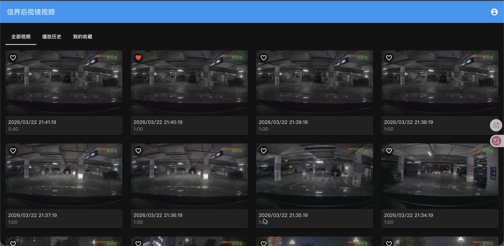
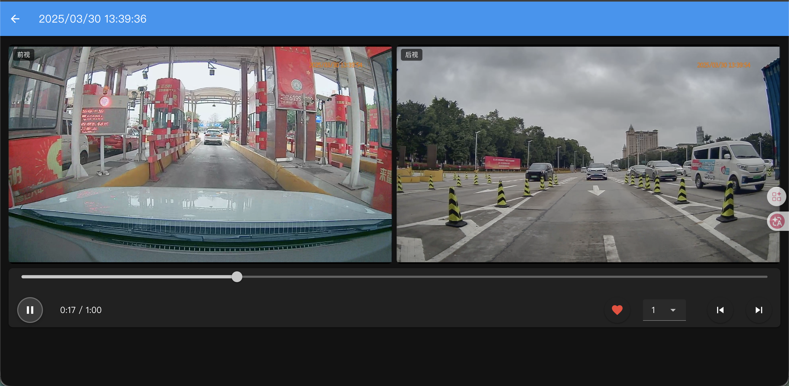
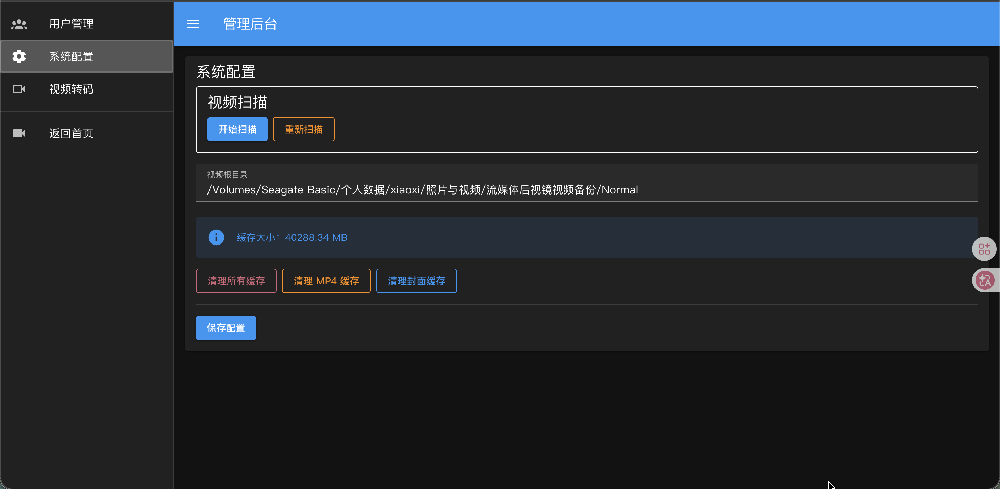
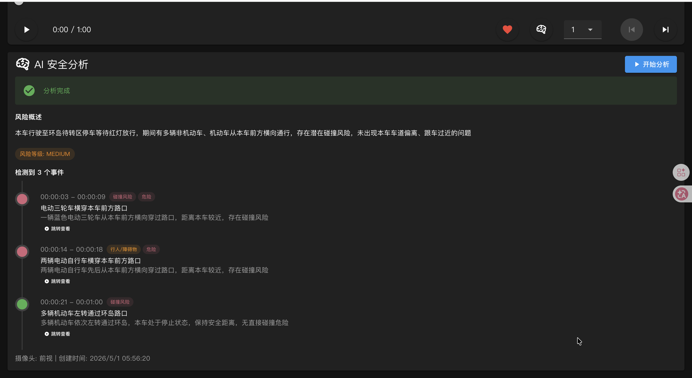

# Car Record View+ / 流媒体后视镜视频播放器

流媒体后视镜记录仪视频播放系统，支持前后摄像头同步播放、移动端与 PC 端响应式访问。

## 功能特性

- 🎬 **双视频同步播放** - 前后摄像头视频同步播放、暂停、进度跳转、倍速控制
- 📱 **响应式设计** - 移动端上下布局，PC 端左右布局，自适应各种屏幕
- 🔄 **自动转码** - TS 格式自动转码为 MP4，生成视频封面
- 🤖 **AI 视频分析** - 使用火山引擎 API 分析视频中的碰撞风险、车距、车道偏离、行人障碍物
- ❤️ **收藏功能** - 标记重要视频，快速访问
- 📜 **播放历史** - 记录观看进度，断点续播
- 🔐 **用户认证** - JWT + HttpOnly Cookie 认证，支持多用户管理
- ⚙️ **管理后台** - 视频扫描、转码管理、用户管理、AI 配置
- ☁️ **远程存储** - 支持 WebDAV 远程视频文件访问，无需本地挂载
- 🚀 **一键启动** - 提供 `dev.sh` / `dev.bat` 脚本同时启动前后端

## 技术栈

### 后端
- **框架**: Egg.js
- **数据库**: SQLite (better-sqlite3)
- **认证**: JWT
- **视频处理**: FFmpeg

### 前端
- **框架**: Vue 3 + Vite
- **UI**: Vuetify (Material Design)
- **状态管理**: Pinia
- **路由**: Vue Router

## 快速开始

### 环境要求

- Node.js >= 18
- FFmpeg (用于视频转码)

### 安装

```bash
# 克隆仓库
git clone https://github.com/your-username/car-record-view-plus.git
cd car-record-view-plus

# 安装后端依赖
cd server && npm install

# 安装前端依赖
cd ../web && npm install
```

### 配置

**本地文件存储：**

创建 `server/config/config.local.js`：

```javascript
// server/config/config.local.js
module.exports = {
  keys: 'your-secret-keys-here',
  jwt: { secret: 'your-jwt-secret-here' },
  video: { rootDir: '/path/to/your/videos' },
  admin: { username: 'admin', password: 'your-password' },
};
```

**WebDAV 远程存储（可选）：**

视频文件存储在 WebDAV 服务器时，在管理后台配置，支持的环境变量：

```bash
export STORAGE_TYPE=webdav
export WEBDAV_URL=http://192.168.1.100:5005
export WEBDAV_USERNAME=your-username
export WEBDAV_PASSWORD=your-password
export WEBDAV_ROOT_DIR=/video
```

> ⚠️ `config.local.js` 已在 `.gitignore` 中，不会被提交到仓库。

### 运行

**一键启动（推荐）：**

```bash
# macOS / Linux
./dev.sh

# Windows
双击 dev.bat
```

**分别启动：**

```bash
# 后端服务 (端口 7001)
cd server && npm run dev

# 前端服务 (端口 3000，代理到后端)
cd web && npm run dev
```

访问 http://localhost:3000 即可使用。

## 便携包分发

将项目打包为一个可直接运行的文件夹，**无需安装 Node.js、npm 依赖**，双击即可启动。

### 构建

```bash
# 在项目根目录执行
npm run build:portable
```

产物在 `dist/portable/` 目录下。

### 产物结构

```
dist/portable/
├── 启动.bat               # Windows 双击启动
├── 启动.command            # macOS 双击启动
├── 启动.sh                 # Linux 启动
├── node/                   # Node.js 运行时（内嵌）
├── ffmpeg                  # ffmpeg 二进制（内嵌）
├── server/                 # 服务端代码 + 前端静态文件
│   ├── app/public/         # 构建后的前端页面
│   ├── node_modules/       # 生产依赖
│   └── start.js            # 启动入口
└── data/                   # 运行时数据（首次启动自动创建）
    ├── car-record.db       # SQLite 数据库
    ├── logs/               # 运行日志
    └── cache/              # 转码缓存
```

### 使用

1. **首次使用**：先通过浏览器访问 http://localhost:7001，用默认凭据登录后，在管理后台配置 `VIDEO_ROOT_DIR`（视频文件目录）
2. **登录凭据**：用户名 `admin`，密码 `changeme`（登录后建议修改）
3. **自定义端口**：编辑启动脚本，修改 `PORT` 环境变量

### 注意事项

- 便携包是**平台相关**的，在 macOS 上构建的不能在 Windows 运行，需在目标平台上构建
- 视频目录需通过管理后台配置，或设置环境变量 `VIDEO_ROOT_DIR`
- 如需 `webdav` 存储模式，可在管理后台配置
- AI 分析功能需在管理后台配置火山引擎 API Key

## 配置项说明

| 配置项 | 必需 | 说明 |
|--------|------|------|
| `keys` | ✅ | Egg.js 应用密钥，用于加密 Session 等 |
| `jwt.secret` | ✅ | JWT 签名密钥 |
| `admin.username` | ✅ | 管理员用户名 |
| `admin.password` | ✅ | 管理员密码 |
| `video.rootDir` | 本地模式 ✅ | 视频文件根目录路径 |
| `STORAGE_TYPE` | 否 | 存储类型：`local`（默认）或 `webdav` |
| `WEBDAV_URL` | WebDAV 模式 ✅ | WebDAV 服务器地址 |
| `WEBDAV_USERNAME` | WebDAV 模式 ✅ | WebDAV 用户名 |
| `WEBDAV_PASSWORD` | WebDAV 模式 ✅ | WebDAV 密码 |
| `WEBDAV_ROOT_DIR` | 否 | WebDAV 远程视频根路径 |

> 生产环境可使用环境变量：`EGG_KEYS`、`JWT_SECRET`、`ADMIN_USERNAME`、`ADMIN_PASSWORD`、`VIDEO_ROOT_DIR`、`STORAGE_TYPE`、`WEBDAV_URL`、`WEBDAV_USERNAME`、`WEBDAV_PASSWORD`、`WEBDAV_ROOT_DIR`

### AI 配置（可选）

在管理后台配置火山引擎 AI 视频分析功能：

| 配置项 | 说明 |
|--------|------|
| `ark_api_key` | 火山引擎 API Key |
| `ark_model_id` | 模型 ID（如 doubao-seed-2-0-lite-260215） |
| `ark_base_url` | API 基础 URL（默认火山引擎 endpoint） |

## 项目结构

```
.
├── dev.sh / dev.bat         # 一键启动脚本
├── server/                   # 后端服务
│   ├── app/
│   │   ├── controller/       # 控制器
│   │   ├── service/
│   │   │   └── storage/      # 存储驱动 (local / webdav)
│   │   ├── middleware/       # 中间件 (JWT 认证)
│   │   └── router.js         # 路由配置
│   ├── config/               # 配置文件
│   ├── database/             # 数据库初始化脚本
│   └── cache/                # 转码缓存目录 (gitignored)
│
├── web/                      # 前端应用
│   ├── src/
│   │   ├── views/            # 页面组件
│   │   ├── api/              # API 封装
│   │   ├── stores/           # Pinia 状态管理
│   │   └── router/           # 路由配置
│   └── public/               # 静态资源
│
└── docs/                     # 文档
```

## 视频目录结构

视频文件按以下结构存放：

```
{VIDEO_ROOT_DIR}/
├── F/                      # 前视摄像头视频
│   ├── V20250323-195526F.ts
│   └── ...
└── R/                      # 后视摄像头视频
    ├── V20250323-195526R.ts
    └── ...
```

文件命名格式：`V{YYYYMMDD}-{HHMMSS}{F|R}.ts`

## 截图展示

### 视频列表


### 双视频同步播放


### 管理后台


### AI 视频分析


## 许可证

[MIT](LICENSE)
